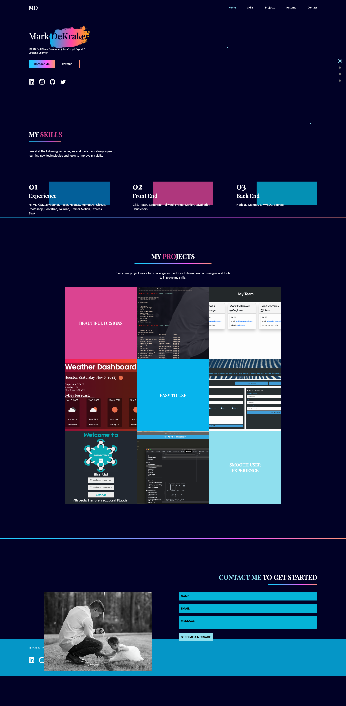

# mdek-react-portfolio

<!-- APPLY SHIELDS -->

  

---

<!-- IS THERE A HEROKU/DEPLOYMENT LINK? -->

# [GitHub Pages: Deployment](https://mrdekraker.github.io/mdek-react-portfolio/)

## Table of Contents

- [Overview](#overview)
- [Technologies](#technologies)
- [Future Plans](#future)
- [License](#license)
- [Questions](#questions)

---

## Overview

This is my latest portfolio. I built it with the help of [Ed Roh](https://github.com/ed-roh), a phenomenal instructor. The main portion of the portfolio is built with React, and the contact form is built with React-hook-form and [Form Submit](https://formsubmit.co/). The portfolio is deployed on GitHub Pages.

---

## Technologies

- React
- Tailwind CSS
- React-hook-form
- Form Submit
- GitHub Pages

---

## Future

The direction I see this going in the future is to add a blog section. I would like to be able to write about my experiences as a developer, and share my knowledge with others.

I also would like to add more projects in the future. I have a few ideas for projects that I would like to build, and I would like to add them to the portfolio to replace some of my weaker projects.

It is also a goal to become more proficient with front end technologies. I would like to add more animations and transitions to the portfolio.

---

## License

---

## Questions

If you have any questions, please contact me at:

- GitHub: [mrdekraker](https://github.com/mrdekraker)
- Email: [mrdekraker](mailto:mrdekraker@gmail.com)
- Twitter: [@DekrakerMark](https://twitter.com/DekrakerMark)

---
